# Ownexa

Ownexa is a full-stack real estate investment platform that combines a React frontend, an Express backend, a Solidity smart contract, Supabase, and a Python ML service to support fractional property ownership. The project is designed around the idea that a physical property can be reviewed, approved, tokenized, sold in fractions, traded on a secondary market, and eventually settled on-chain.

At a practical level, the repository contains four coordinated systems:

- `Frontend/`: investor, owner, and admin UI built with React + Vite
- `Backend/`: Express API for authentication, property workflows, listings, holdings, transactions, and analytics
- `Contract/`: ERC-1155 smart contract for tokenized property ownership and settlement
- `Model/`: FastAPI + scikit-learn service for investor risk profiling and ML utilities

## What The Platform Does

Ownexa models a real-estate investment lifecycle from submission to exit:

1. A user signs up and provides investment profile details.
2. The backend creates the account in Supabase.
3. The ML service classifies the user's risk profile and stores it back in the user record.
4. A property owner submits a property with media, documents, and wallet information.
5. An admin validates or reviews that submission.
6. Once approved, the property can be represented as fractional ERC-1155 tokens on-chain.
7. Investors can buy tokens in the primary market.
8. Existing holders can re-list tokens in the secondary market.
9. The original lister can settle the property, after which holders redeem their tokens for payout.

This gives the repo a hybrid architecture: off-chain business logic and storage on Supabase, with ownership transfer and settlement logic enforced on Ethereum-compatible infrastructure.

## Why Ownexa

Traditional real-estate investing is often capital intensive, slow, and geographically limited. Ownexa approaches that problem by:

- lowering entry cost through fractional token ownership
- keeping transaction history and token movement transparent on-chain
- separating admin review from market availability
- supporting both primary issuance and secondary liquidity
- introducing investor profiling through ML-assisted risk classification

## Project Screenshots

### 🏠 Dashboard & Property Listings

| | |
|---|---|
| 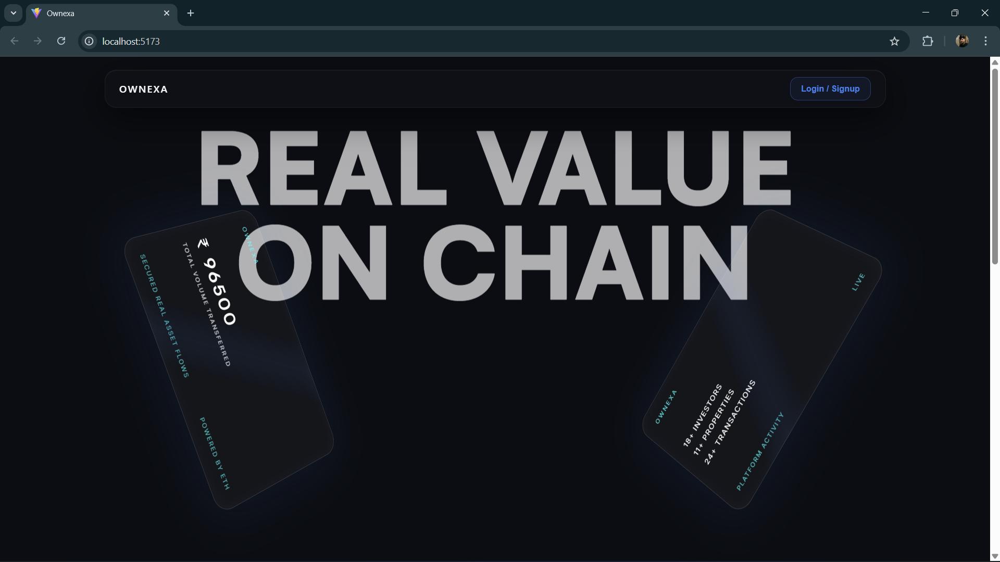 | 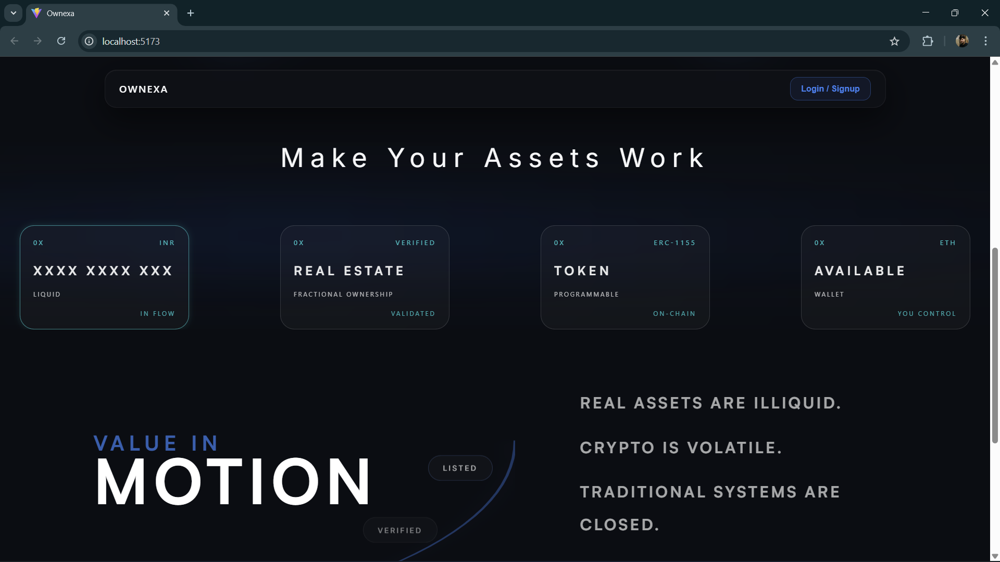 |
| 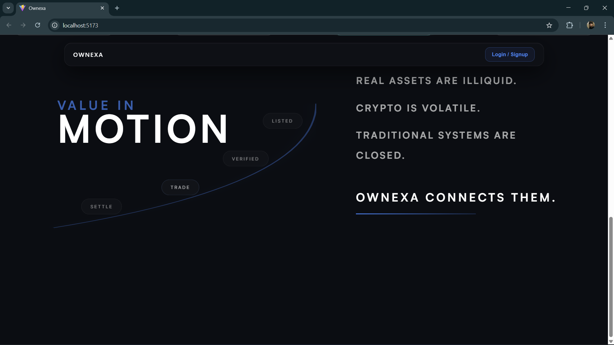 | 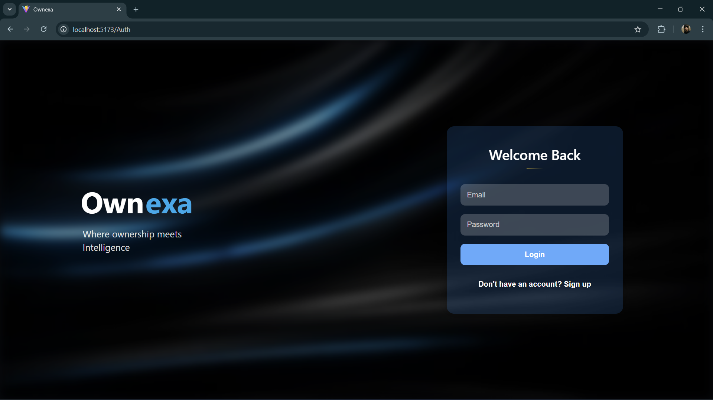 |

---

### 💼 User Profile & Transactions

| | |
|---|---|
| 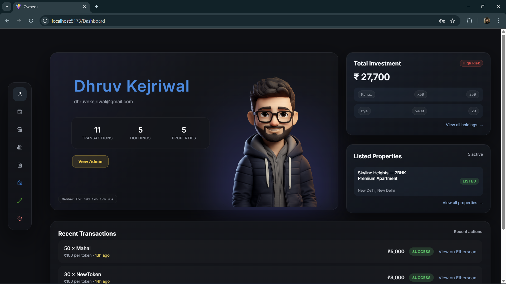 | 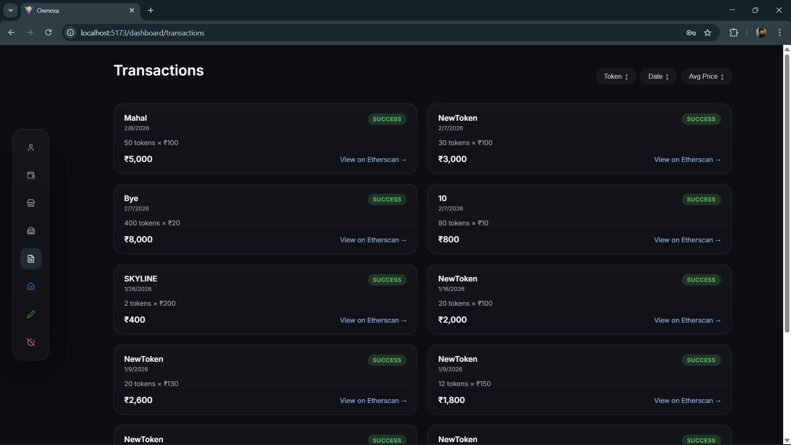 |
| 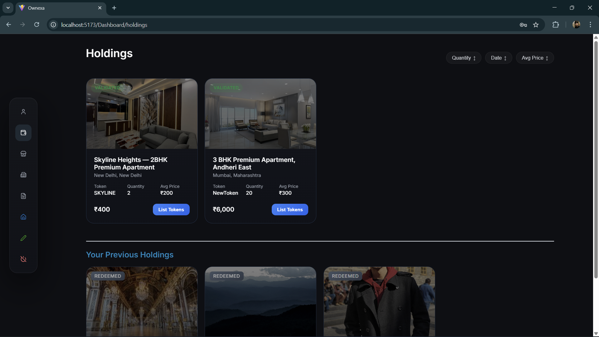 | 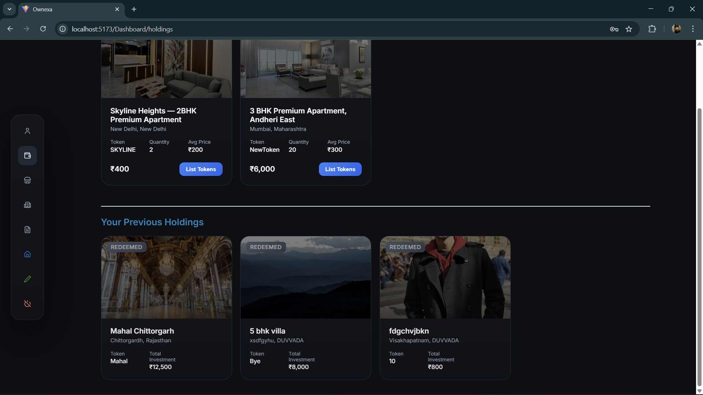 |

---

### 🛠 Admin Panel

| | |
|---|---|
| 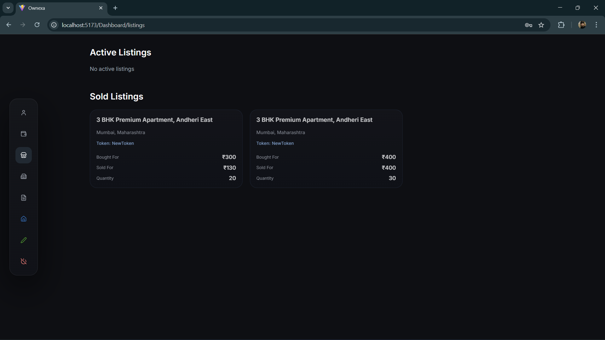 | 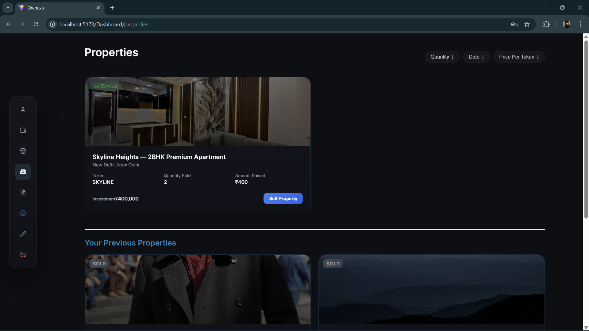 |
| 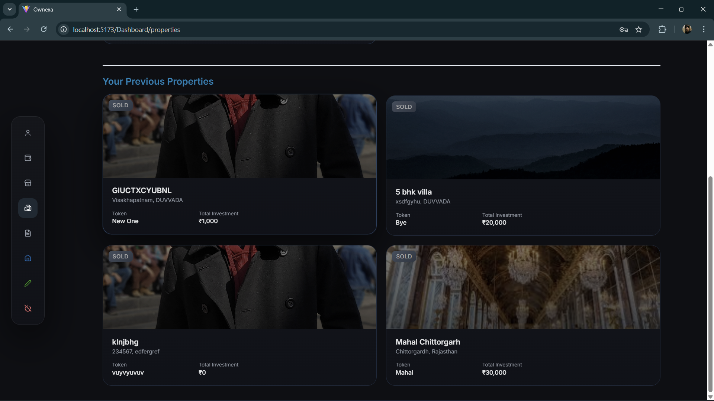 | 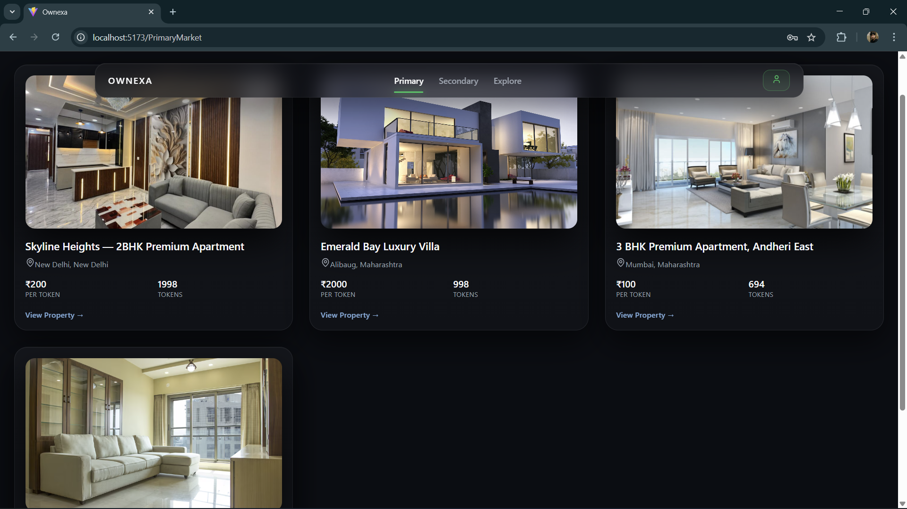 |

---

### 🔗 Blockchain & System

| | |
|---|---|
| 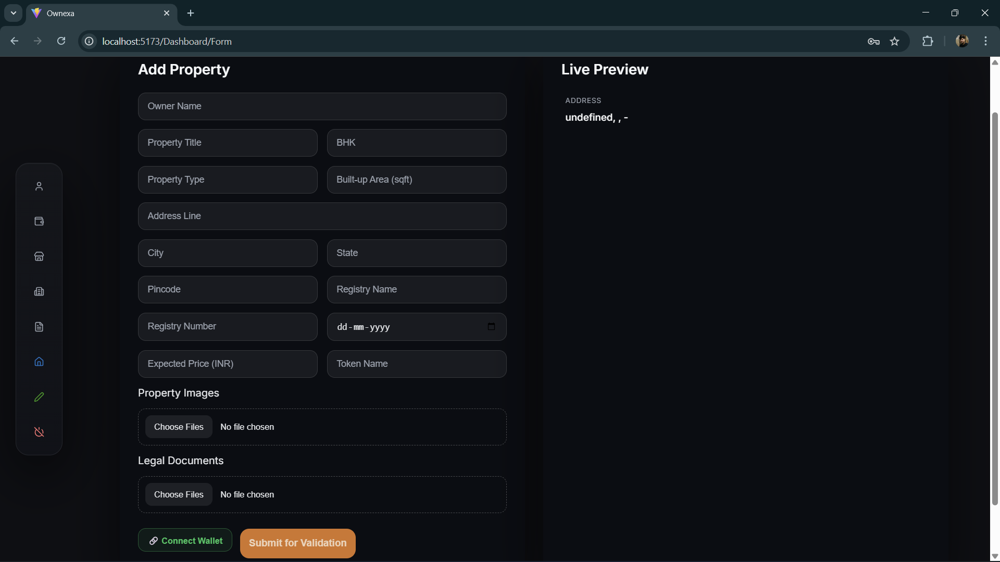 | 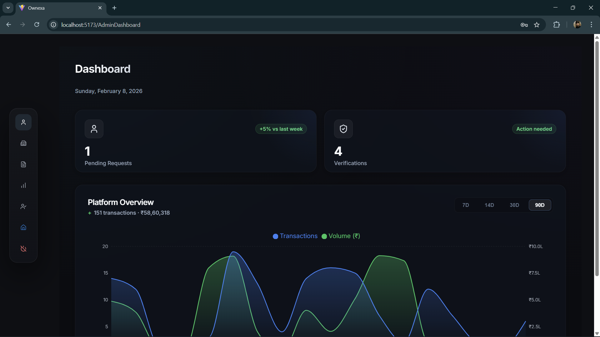 |
| 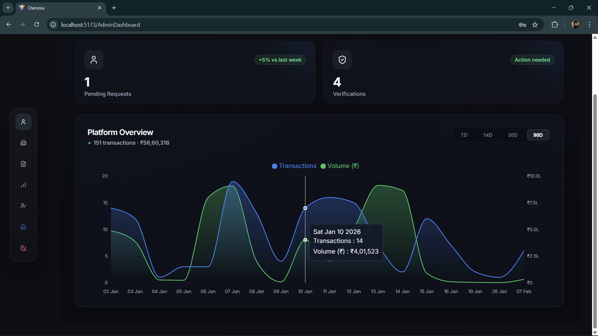 | 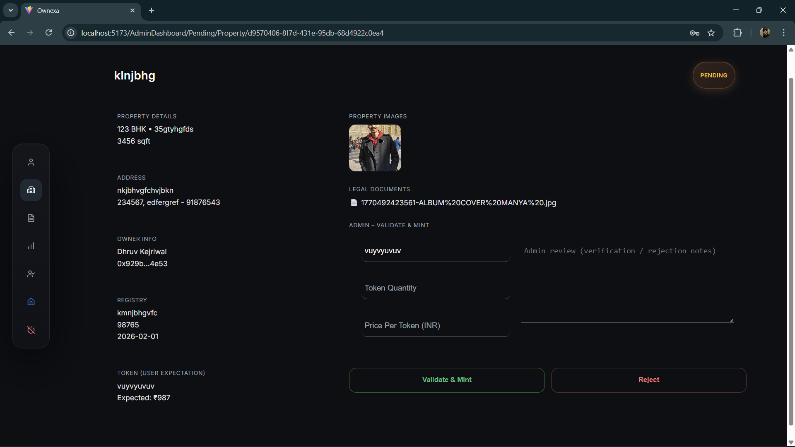 |
| 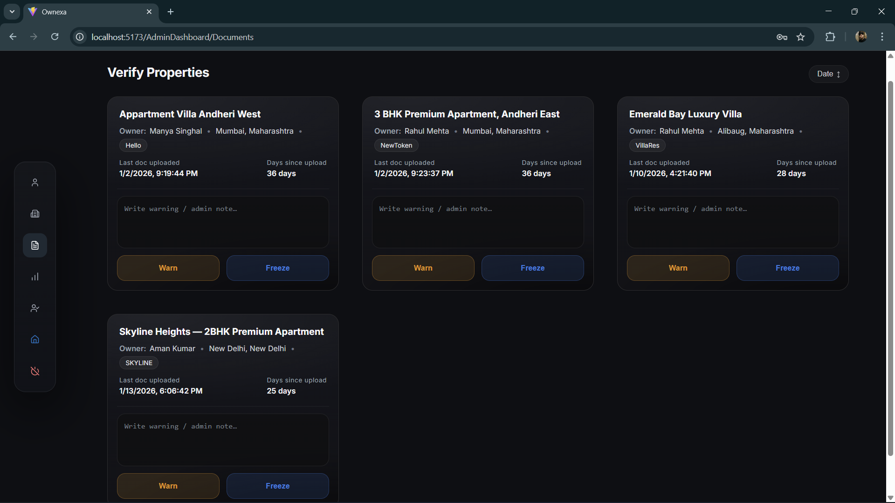 | 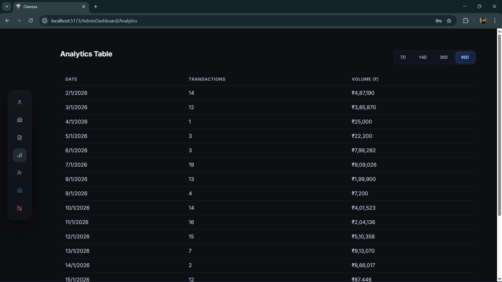 |

## Core Features

### Investor Experience

- Sign up and log in with cookie-based Supabase-backed authentication
- Receive a stored risk profile based on age, income, investment amount, and investment duration
- Browse validated tokenized properties in the primary market
- Browse active resale inventory in the secondary market
- View personal holdings, listings, transactions, and owned properties from the dashboard
- Interact with the property token smart contract through MetaMask-enabled frontend flows

### Property Owner Experience

- Submit property metadata, wallet address, property images, and legal documents
- Track owned properties from the dashboard
- Move a property into the platform review flow
- Participate in primary issuance through tokenized property listing
- Settle a property and distribute redemption value to token holders on-chain

### Admin Experience

- Review pending property submissions
- Validate properties before they appear in the market
- Warn or freeze flagged properties
- View stale validated properties that may need intervention
- Access analytics tables summarizing recent transaction activity and volume

### Blockchain Features

- ERC-1155 based tokenization per property
- Primary token purchase flow
- Secondary listing creation and purchase flow
- Contract-held inventory for unsold primary and active secondary tokens
- Settlement pool and token redemption flow
- Commission accumulation and owner-only commission withdrawal

### ML Features

- User risk profiling model trained on processed investor data
- Return prediction model trained on processed property features
- Property risk scoring model trained on processed property features
- FastAPI endpoint that currently updates a user's stored risk label during signup

## System Architecture

```text
Frontend (React/Vite)
    |
    | HTTP + cookies
    v
Backend (Express)
    |
    | Supabase client / auth / storage
    v
Supabase

Frontend
    |
    | ethers.js + MetaMask
    v
PropertyToken Smart Contract (ERC-1155)

Backend
    |
    | HTTP call during signup
    v
ML API (FastAPI)
```

## Repository Structure

```text
Ownexa/
├── assets/                    # README screenshots
├── Frontend/                  # React + Vite application
├── Backend/                   # Express API and Supabase data layer
├── Contract/                  # Hardhat project and Solidity contract
├── Model/                     # ML training, inference, FastAPI service
└── README.md
```

### Frontend Highlights

- `src/App.jsx`: route tree and protected routing setup
- `src/Layouts/`: market, dashboard, and admin shells
- `src/Pages/Auth/Auth.jsx`: login/signup and investor profile capture
- `src/Pages/Forms/AddProperty.jsx`: property submission form with document upload and wallet connect
- `src/Pages/Market/`: primary market, secondary market, and property detail pages
- `src/Pages/Profile/`: profile, holdings, transactions, listings, and property management
- `src/Pages/Admin/`: admin review, validation, and analytics screens
- `src/hooks/useAuth.js`: authentication state lookup from `/auth/me`
- `src/abi/PropertyToken.json`: contract ABI used by the UI

### Backend Highlights

- `server.js`: Express app bootstrap, middleware, and route mounting
- `Routes/Authentication/Auth.js`: signup, login, logout, and session verification
- `Routes/Property/`: property creation, fetch, validation, warning, freeze, and sold-state updates
- `Routes/Transactions/PrimaryTransactions.js`: transaction creation and transaction history
- `Routes/Holdings/Holding.js`: portfolio holdings and hold freezing
- `Routes/Listings/Listing.js`: listing creation, fetch, cancellation, and secondary inventory access
- `Routes/Analytics/Analytics.js`: public platform counters and admin analytics
- `Middleware/Middleware.js`: Supabase token verification, role lookup, and multer upload config
- `Database/`: Supabase data access modules grouped by domain

### Contract Highlights

- `contracts/PropertyToken.sol`: ERC-1155 property token contract
- `scripts/Deploy.js`: deployment script for Sepolia or other configured networks
- `hardhat.config.js`: network and Solidity compiler configuration

### Model Highlights

- `api/ml_api.py`: FastAPI app exposing the recommendation/risk endpoint
- `src/training/`: scripts for training each ML model
- `src/inference/`: inference helpers for risk, return, and recommendations
- `Database/supabase_client.py`: Python Supabase client for model-side persistence
- `models/`: pre-trained `.pkl` model artifacts
- `test/` and `test_models.py`: model evaluation scripts

## Tech Stack

### Frontend

- React 19
- Vite 7
- React Router 7
- Ethers 6
- Recharts
- React Toastify
- Lucide React

### Backend

- Node.js
- Express 5
- Supabase JavaScript SDK
- Cookie Parser
- CORS
- Multer

### Blockchain

- Solidity `^0.8.x`
- Hardhat
- OpenZeppelin Contracts
- Ethers.js
- Sepolia-ready network config

### Machine Learning

- Python
- FastAPI
- Uvicorn
- pandas
- numpy
- scikit-learn
- joblib

### Data / Infrastructure

- Supabase Auth
- Supabase Database
- Supabase Storage or file persistence integration through backend modules

## Main User Flows

### 1. Authentication And Risk Profiling

The signup flow collects:

- username
- email
- password
- gender
- age
- annual income
- investment amount
- investment duration

After signup, the backend calls the ML API at `http://127.0.0.1:8000/recommend`. The current implementation stores the predicted `risk_label` back into the `users` table and does not yet return ranked property recommendations to the UI.

### 2. Property Submission And Review

The property submission form collects:

- owner name
- title
- BHK
- property type
- built-up area
- address details
- registry metadata
- expected price
- token name
- wallet address
- property images
- legal documents

These are sent through a multipart request to `/property/add`. Admins then review the submission and can validate, warn, or freeze a property depending on platform policy.

### 3. Primary Market

The primary market page fetches:

- `GET /properties?status=Validated&listed=true`

This is intended to show approved, market-visible properties available for fractional purchase. On-chain token purchase is then paired with backend transaction and holding updates.

### 4. Secondary Market

The secondary market page fetches:

- `GET /propertylisting?status=ACTIVE`

This surfaces active resale listings created by holders who want to sell previously purchased fractions.

### 5. Settlement And Redemption

When a property owner settles a property on-chain:

- unsold contract-held tokens are burned
- a settlement price per token is derived from the ETH supplied
- unsold inventory value is refunded to the property owner
- the remaining settlement pool is reserved for token holders
- holders redeem tokens for payout using the redemption function

## Smart Contract Overview

The core contract is [`Contract/contracts/PropertyToken.sol`](/Users/dhruv/Blockchain/Ownexa/Contract/contracts/PropertyToken.sol).

### Important Contract Data Structures

- `Property`: tracks token supply, token name, price per token, settlement price, and active state
- `Listing`: tracks secondary listing id, property id, quantity, price per token, seller, and active state

### Important Contract Functions

- `listProperty(...)`: creates a property and mints the total supply to the contract
- `buyTokens(propertyId, amount)`: buys from the primary market with a 2% commission
- `createListing(propertyId, amount, price)`: escrows user-held tokens into the contract for resale
- `cancelListing(listingId)`: returns tokens to seller and disables the listing
- `buyListing(listingId)`: buys a secondary listing with a 2% commission
- `settleProperty(propertyId)`: closes the property and funds the settlement pool
- `redeemTokens(propertyId)`: lets holders burn tokens in exchange for payout
- `withdrawCommission()`: owner-only commission withdrawal

### Current Contract Behavior Notes

- The contract is ERC-1155 based, so each property maps to a token id.
- Primary inventory is initially held by the contract itself.
- Secondary listings also escrow tokens in the contract until sale or cancellation.
- Commission is accumulated centrally and withdrawn by the contract owner.

## Backend API Overview

The backend is mounted from [`Backend/server.js`](/Users/dhruv/Blockchain/Ownexa/Backend/server.js) and currently listens on `http://localhost:4000`.

### Authentication

- `POST /auth/signup`: create user and trigger ML risk profiling
- `POST /auth/login`: authenticate and set `sb-access-token` cookie
- `GET /auth/logout`: clear session cookie
- `GET /auth/me`: resolve current authenticated user

### Property Routes

- `POST /property/add`: submit a new property with files
- `PUT /property/validate`: admin validation
- `PUT /property/warn`: admin warning flow
- `PUT /property/freeze`: admin freeze flow
- `PUT /property/sold`: mark property sold/frozen after sale flow
- `GET /properties`: fetch properties by `status` and `listed`
- `GET /properties/:id`: fetch one property by id, `status`, and `listed`
- `GET /userproperties`: fetch properties submitted by logged-in user
- `GET /warnedproperties`: admin-only stale/flagged property retrieval

### Transactions

- `POST /transaction?type=primary|secondary`: persist a completed transaction
- `GET /transaction?status=SUCCESS|FAILED`: fetch user transaction history

### Holdings

- `GET /holdings`: fetch current user holdings
- `PUT /holding/freeze`: freeze a holding record

### Listings

- `POST /listing`: create a new secondary listing
- `GET /listings?tag=buyer|seller&status=...`: fetch user-linked listings
- `GET /propertylisting`: fetch listings by status
- `GET /propertylisting/:id`: fetch active listings for a property
- `POST /cancellisting`: cancel a listing and restore holdings

### Analytics

- `GET /public/stats`: public counters for users, validated properties, transactions, and volume
- `GET /admin/stats?days=7|14|30|90`: admin analytics dataset

## Machine Learning Module

The ML app lives in [`Model/api/ml_api.py`](/Users/dhruv/Blockchain/Ownexa/Model/api/ml_api.py).

### What It Currently Does

- loads processed property CSV data on startup
- accepts a user profile payload on `PUT /recommend`
- predicts the user's risk profile using `risk_profile_model.pkl`
- writes the resulting `risk_label` back to Supabase

### Input Schema

```json
{
  "id": "user-id",
  "age": 28,
  "income": 1200000,
  "investment_amount": 250000,
  "investment_duration": 24
}
```

### Training Scripts

- `src/training/train_risk_profile.py`
- `src/training/train_return_model.py`
- `src/training/train_property_risk.py`

### Evaluation Script

Run:

```bash
cd Model
python3 test/test_model_accuracy.py
```

This prints:

- risk model classification accuracy and confusion matrix
- return model MAE and R2
- property risk model MAE and R2

### Important Accuracy Note

The recommendation helper exists in `src/inference/reccomendation_engine.py`, but the current FastAPI endpoint only persists the user risk label. End-to-end recommendation delivery is not yet wired into the frontend.

## Environment Variables

The repository does not include ready-made `.env.example` files, so you will need to create environment files manually.

### `Frontend/.env`

```env
VITE_API_BASE=http://localhost:4000
VITE_SMART_CONTRACT=YOUR_DEPLOYED_CONTRACT_ADDRESS
VITE_MALE_AVATARS=["https://example.com/avatar1.png","https://example.com/avatar2.png"]
VITE_FEMALE_AVATARS=["https://example.com/avatar3.png","https://example.com/avatar4.png"]
```

### `Backend/.env`

```env
SUPABASE_URL=your_supabase_project_url
SUPABASE_ANON_KEY=your_supabase_anon_key
SUPABASE_SERVICE_ROLE_KEY=your_supabase_service_role_key
NODE_ENV=development
```

### `Contract/.env`

```env
SEPOLIA_RPC_URL=your_rpc_endpoint
PRIVATE_KEY=your_wallet_private_key
```

### `Model/.env`

```env
SUPABASE_URL=your_supabase_project_url
SUPABASE_SERVICE_ROLE_KEY=your_supabase_service_role_key
```

## Local Development Setup

### Prerequisites

Install these before running the project:

- Node.js 18+ recommended
- npm
- Python 3.10+ recommended
- MetaMask browser extension
- Supabase project with the required tables and auth enabled
- Sepolia RPC endpoint if deploying the contract
- A funded Sepolia wallet for deployment/testing

### 1. Clone And Install Dependencies

```bash
git clone <your-repo-url>
cd Ownexa
```

Install each service separately:

```bash
cd Frontend
npm install
```

```bash
cd Backend
npm install
```

```bash
cd Contract
npm install
```

```bash
cd Model
python3 -m pip install -r requirements.txt
```

### 2. Start The ML API

The backend signup flow calls the ML API on `127.0.0.1:8000`, so start this first:

```bash
cd Model
python3 -m uvicorn api.ml_api:app --reload --host 127.0.0.1 --port 8000
```

### 3. Start The Backend

```bash
cd Backend
npm run dev
```

The server is configured to listen on:

```text
http://localhost:4000
```

### 4. Start The Frontend

```bash
cd Frontend
npm run dev
```

The frontend is expected to run on:

```text
http://localhost:5173
```

### 5. Deploy The Smart Contract

Compile:

```bash
cd Contract
npx hardhat compile
```

Deploy to Sepolia:

```bash
cd Contract
npx hardhat run scripts/Deploy.js --network sepolia
```

After deployment:

1. Copy the deployed contract address.
2. Set `VITE_SMART_CONTRACT` in `Frontend/.env`.
3. Make sure the ABI in `Frontend/src/abi/PropertyToken.json` matches the deployed contract build.

## Recommended Startup Order

For the smoothest local setup, start services in this order:

1. ML API
2. Backend
3. Frontend
4. Contract deployment and wallet configuration

This matters because:

- signup attempts to contact the ML API immediately
- frontend auth and data pages depend on the backend
- blockchain actions depend on MetaMask plus a deployed contract address

## Notes About Current Configuration

- Backend CORS currently allows `http://localhost:5173`.
- The signup route calls the ML API using a hardcoded local URL: `http://127.0.0.1:8000/recommend`.
- Multer is configured with in-memory file storage and a 10 MB per-file limit.
- Authentication is driven by a Supabase access token stored in an `httpOnly` cookie named `sb-access-token`.

## Testing And Validation

### Frontend

Available scripts:

```bash
cd Frontend
npm run build
npm run lint
```

### Backend

Available scripts:

```bash
cd Backend
npm run dev
npm start
```

There are currently no dedicated backend test scripts defined in `package.json`.

### Contract

Compile with:

```bash
cd Contract
npx hardhat compile
```

The current `package.json` does not include implemented contract tests.

### ML

Validate saved model behavior with:

```bash
cd Model
python3 test/test_model_accuracy.py
```

## Known Gaps And Limitations

This README is based on the current codebase behavior, so these are worth knowing before you build on top of it:

- The ML API currently stores a risk label but does not yet return full property recommendations to the UI.
- Root-level documentation originally referenced `Blockchain/` and `ML_API/`, but the actual folders in this repo are `Contract/` and `Model/`.
- The backend expects Supabase structure to already exist; schema migrations are not included in this repository.
- Contract deployment is configured for Sepolia, but operational wallet/network setup remains manual.
- Contract tests are not implemented yet.
- Backend test coverage is not present yet.

## Suggested Future Improvements

- add `.env.example` files for all services
- add backend and contract test suites
- document Supabase schema and storage buckets
- expose full ML recommendations, not only risk labels
- add Docker or Compose setup for one-command local startup
- add contract event indexing for richer portfolio and analytics views

## Developer

**Dhruv Kejriwal**

Full Stack Blockchain Developer

## License

This repository currently states MIT licensing intent in the previous README, but no standalone license file is present at the root. Add a `LICENSE` file if you want the project to be explicitly and formally distributed under MIT.
